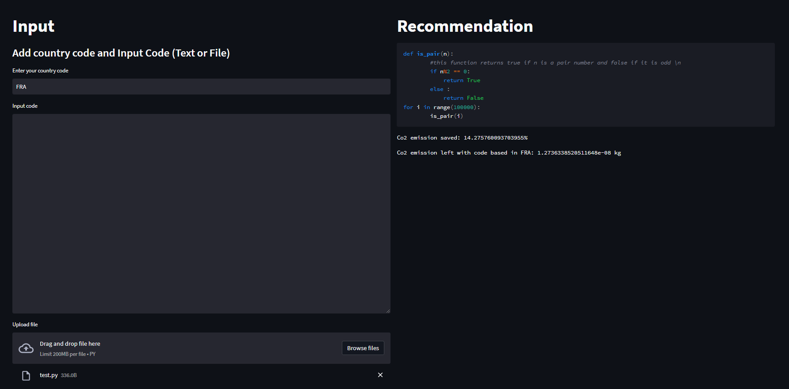

# EcoCode

This project was part of OpenAI Climate Change Hackathon - GreenCoding 2022.

This proof of concept that GPT-3 can improve code efficiency and reduce code emissions. It is a web-application that takes as input python code or a .py file and improve the code to make it more efficient.
For more information on GPT-3 : [Usage Guidelines](https://beta.openai.com/docs/usage-policies) | [Terms of Use](https://openai.com/api/policies/terms/)

### How does it work?

### Getting started

To run this app locally, follow the steps:

1. Clone the repository
2. Create a virtual environment (`python3 -m venv venv && source venv/bin/activate`)
3. Install the requirements by running `make install`
4. Ensure your OpenAI API key is set as an environment variable `OPENAI_API_KEY` (see best practices around API key safety [here](https://help.openai.com/en/articles/5112595-best-practices-for-api-key-safety))
5. Run the [streamlit](https://streamlit.io/) app by running `make run`
6. Open the app in your browser at `http://localhost:8501`
7. ( *for contributing* ) To run the formatter, run `make format`

Project Organization
--------------------

    ├── LICENSE
    ├── README.md          <- The top-level README for developers using this project.
    │
    ├── notebooks          <- Jupyter notebooks. Command to run the web-app.
    ├── requirements.txt   <- The requirements file for reproducing the analysis environment, e.g.
    │                         generated with`pip freeze > requirements.txt`
    ├── setup.py           <- makes project pip installable (pip install -e .) so src can be imported
    ├── src                <- Source code for use in this project.
    │   ├── __init__.py    <- Makes src a Python module
    │
    └── tox.ini            <- tox file with settings for running tox; see tox.readthedocs.io
